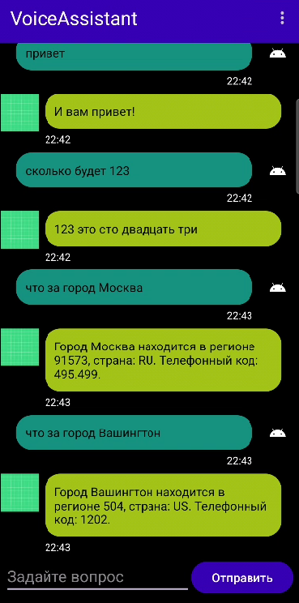

# VoiceAssistant - Голосовой помощник для Android

## О проекте

**VoiceAssistant** — это мобильное приложение для Android, разработанное в рамках серии лабораторных работ. Приложение представляет собой чат с ассистентом, который способен поддерживать диалог, отвечать на простые вопросы, а также обращаться к внешним сетевым сервисам для получения актуальной информации.

Этот проект демонстрирует ключевые аспекты современной Android-разработки, включая:
*   Создание пользовательского интерфейса с помощью `RecyclerView`.
*   Работу с сетевыми запросами с использованием библиотеки `Retrofit`.
*   Парсинг (разбор) данных в форматах **JSON** и **XML**.
*   Реализацию асинхронных операций.
*   Поддержку светлой и темной тем оформления.
*   Сохранение состояния при повороте экрана и смене конфигурации (`ViewModel`/`onSaveInstanceState`).
*   Постоянное хранение истории диалога с использованием `SQLite`.

## Функционал

Ассистент умеет распознавать и отвечать на следующие типы вопросов:

*   **Простые приветствия:** "Привет", "Как дела?".
*   **Информация о времени:** "Который час?", "Какой сегодня день?".
*   **Работа с сетью (OpenWeatherMap API):**
    *   Запрос: "погода киров"
    *   Ответ: "В городе киров сейчас 3 градуса, небольшая облачность"
*   **Работа с сетью (htmlweb.ru API):**
    *   Запрос: "сколько будет 123"
    *   Ответ: "123 это сто двадцать три"
    *   Запрос: "что за город Вашингтон"
    *   Ответ: "Город Вашингтон находится в регионе 504, страна: US. Телефонный код: 1202."
*   **Обработка языка:** Корректное склонение слова "градус" в зависимости от числа.



## Технологический стек

*   **Язык:** Kotlin
*   **Архитектура:** Single Activity
*   **UI:** XML-разметка, `RecyclerView`, `ConstraintLayout`, `ViewBinding`
*   **Сеть:**
    *   `Retrofit` - для выполнения HTTP-запросов.
    *   `Gson Converter` - для парсинга JSON.
    *   `SimpleXML Converter` - для парсинга XML.
    *   `OkHttp Logging Interceptor` - для отладки сетевых запросов.
*   **Хранение данных:**
    *   `SQLite` (через `SQLiteOpenHelper`) - для постоянного хранения истории чата.
    *   `SharedPreferences` - для сохранения выбранной пользователем темы.
*   **Синтез речи:** `TextToSpeech (TTS)`

## Настройка и запуск

Для сборки и запуска проекта на локальной машине выполните следующие шаги.

### 1. Предварительные требования
*   Android Studio (последняя версия).
*   Android SDK с API уровнем 24 или выше.

### 2. Получение API ключей
Проект использует внешний сервис для получения данных о погоде.
1.  Зарегистрируйтесь на сайте [openweathermap.org](https://openweathermap.org).
2.  Получите ваш персональный **API Access Key**.

### 3. Настройка проекта
1.  Клонируйте репозиторий:
    ```bash
    git clone <URL вашего репозитория>
    ```
2.  Откройте проект в Android Studio.
3.  Откройте файл `app/src/main/java/com/example/voiceassistant/ForecastApi.kt`.
4.  Найдите строку `@GET("/data/2.5/weather?appid=ТВОЙ_КЛЮЧ&...")` и замените `ТВОЙ_КЛЮЧ` на ваш реальный API ключ от OpenWeatherMap.
5.  Дождитесь, пока Gradle завершит синхронизацию проекта.

### 4. Запуск
Подключите физическое устройство Android или запустите эмулятор, а затем нажмите `Run 'app'` в Android Studio.

## Особенности реализации

### Смена тем
Приложение поддерживает светлую и темную темы. Переключение осуществляется через меню в правом верхнем углу. Выбранная тема сохраняется между перезапусками приложения с помощью `SharedPreferences`.

### Сохранение состояния
История диалога сохраняется при изменении конфигурации (например, при повороте экрана или смене темы) с помощью механизма `onSaveInstanceState` и `Parcelable`.

### База данных
При закрытии приложения вся история чата сохраняется в локальную базу данных SQLite. При следующем запуске история полностью восстанавливается.

## Скачать
Готовую версию приложения (`.apk`) можно скачать на [странице релизов](https://github.com/11qfour/VoiceAssistant/releases).